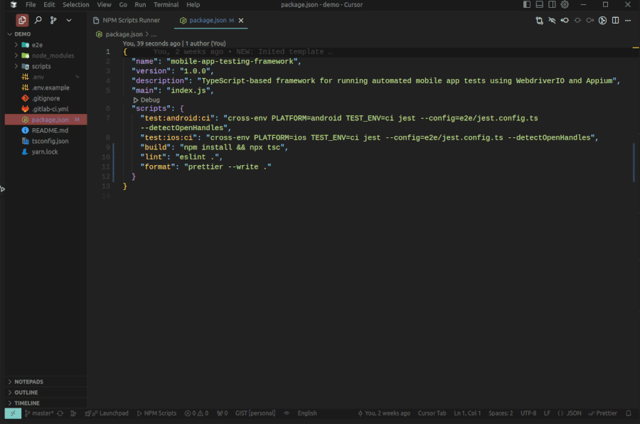
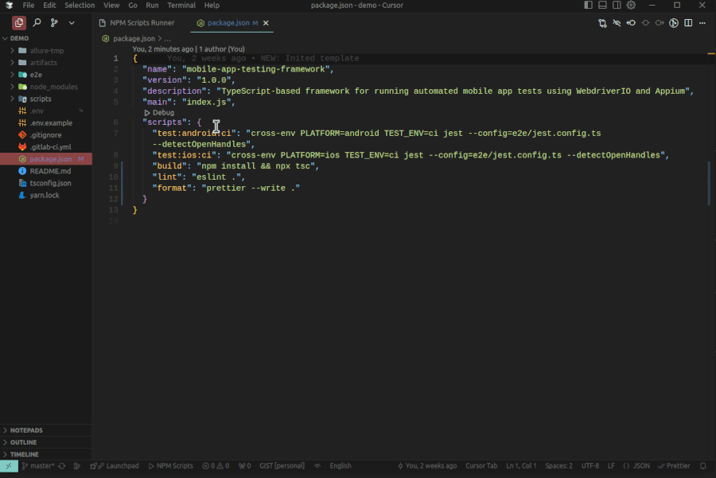

# NPM Scripts Runner

Visual Studio Code (CursorAI) **[extension](https://marketplace.visualstudio.com/items?itemName=xxx87.npm-scripts-runner)** to easily discover and run npm scripts from your project's package.json files.

## Features

- Shows a button in the status bar for quick access
- Lists all npm scripts from all package.json files in your workspace
- Provides a clean interface to view and run scripts
- Allows running scripts in shared or individual terminals
- Auto-refreshes when package.json files change

## Usage

- Click on the "NPM Scripts" button in the status bar or run the command "Show NPM Scripts Runner"
- A panel will open showing all available npm scripts
- Click "Run" next to any script to execute it in the terminal
- Toggle "Shared Terminal" to decide whether to use a single terminal for all scripts or separate terminals

## Demo

## Requirements

- VS Code version 1.60.0 or higher

## Extension Settings

This extension contributes the following commands:

- `npm-scripts-runner.showScripts`: Show the NPM Scripts Runner panel

##

